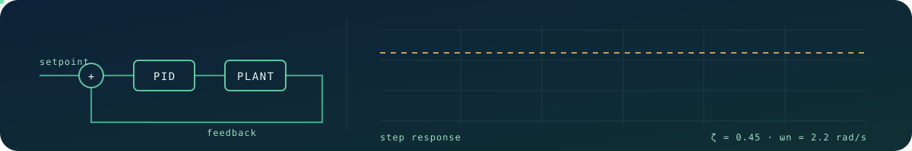

<p align="center">
  
</p>

# UPID

<p align="center">
  
  
  
</p>

A small, deterministic PID controller. Give it a setpoint, a measurement and an
elapsed time; get back a bounded actuator command.

**Portable, not platform.** Two files of plain C99 — no platform headers, no hardware
access, no build system, no dependencies beyond `libm`. UPID never reads a clock, a
pin, or a sensor.

No allocation either: you declare the controller, `upid_create()` initialises it, and
everything after that is arithmetic.

## Install

Copy `include/upid.h` and `src/upid.c` into your project and build them with your
other sources. That is the whole install.

- **Arduino** — both files beside your `.ino` or in `Arduino/libraries/upid/src/`.
  Take `dt` from `micros()`.
- **ESP-IDF** — drop into a component and list `upid.c` in
  `idf_component_register(SRCS ...)`. Take `dt` from `esp_timer_get_time()`.
- **Anything else** — add `upid.c` to your build. Needs C99 and `<math.h>`.

C++ can include the header directly; it carries an `extern "C"` block.

What changed in each version: [Releases](https://github.com/JonasAtelier/upid/releases).

## Use

```c
#include "upid.h"

struct upid_cfg cfg;
struct upid pid;

upid_cfg_init(&cfg);              /* valid defaults to start from */
cfg.kp = 2.0f;
cfg.o_max = 255.0f;               /* 8-bit PWM range */

if (upid_create(&pid, &cfg) != UPID_OK) {
    /* bad tuning; do not enter the control loop */
}

/* once per control cycle */
float dt_s = elapsed_micros / 1000000.0f;
if (upid_spin(&pid, setpoint, measurement, dt_s) == UPID_OK) {
    apply_output(upid_get_output(&pid));
}
```

Two calls to get running. Start from `upid_cfg_init()` rather than a zeroed struct —
`o_min < o_max` is required, so all-zero is not a valid cfg — then `upid_create()`,
which validates before it commits: bad tuning leaves the controller unrunnable rather
than running on bad numbers.

> **`dt_s` is seconds.** Divide milliseconds by `1000.0f`, microseconds by
> `1000000.0f`. Must be finite and greater than zero.

A call that returns an error leaves the output where it was: `upid_get_output()` still
holds the last good value.

Runnable version driving a simulated plant:

```sh
cc -std=c99 -Wall -Wextra -Iinclude examples/basic_pid.c src/upid.c -lm -o basic_pid
./basic_pid
```

### API

Every call takes the controller as its first argument, and returns `upid_sta` unless
the table says otherwise.

| Call | Does |
|---|---|
| `upid_cfg_init(&cfg)` | Fill a cfg with valid defaults |
| `upid_create(&pid, &cfg)` | Clear the state, validate the tuning, start in automatic |
| `upid_spin(&pid, setpoint, measurement, dt_s)` | One control cycle |
| `upid_get_output(&pid)` | The latest bounded output. Returns `float` |
| `upid_set_manual(&pid, output)` / `upid_set_auto(&pid)` | Hand control over and back |
| `upid_reset(&pid, measurement, output)` | Align state with a known plant state |
| `upid_get_cfg(&pid)` / `upid_set_cfg(&pid, &cfg)` | Tune while running |
| `upid_get_mode(&pid)` | Who owns the output. Returns `upid_mode` |
| `upid_cfg_status(&pid)` | Whether the tuning is valid |

Declare the controller wherever you like — stack, static, inside your own struct.
Nothing is allocated. One that never went through `upid_create()` is refused by every
call, so forgetting it returns `UPID_EINVAL_CFG` rather than running on stale memory.

## What each knob does

Measured by running `src/upid.c` against a simulated plant: `dt = 0.02 s`, setpoint 50
from a standing start of 20, only the named gain changing between rows.

Two plants, because they teach different things — a **lag** plant (a heater) for `kp`,
`ki` and the limits, and an **inertia** plant (a motor moving a mass) for `kd`, since
derivative action is for systems that carry momentum.

```
setpoint --->(-)---> upid_spin() ---> actuator ---> plant ---+---> measurement
              ^        kp ki kd          PWM, valve            |
              +------------------------------------------------+
```

You own everything outside `upid_spin()`. It turns an error into a number; the
sensor, the actuator and the loop timing are yours.

### `kp` — proportional, how hard it reacts now

Output proportional to the current error. Big error, big push. It does most of the
work; tune it first.

| `kp` | Reaches 90% | Peak | Settles at | Off target |
|---|---|---|---|---|
| 0.5 | never | 44.33 | 44.33 | -5.67 |
| 2 | 1.34 s | 48.57 | 48.57 | -1.43 |
| 8 | 0.34 s | 49.63 | 49.63 | -0.37 |

Raising `kp` gets you there faster, but **nothing reaches 50**. Proportional action
needs error in order to produce output, so it always parks short. That gap is *droop*,
and no amount of `kp` removes it — push far enough and the loop rings instead.

### `ki` — integral, it remembers

Accumulates error over time, so a small error that never goes away keeps building
output until it does. This is what kills the droop.

| `ki` | Reaches 90% | Peak | Settles at | Off target |
|---|---|---|---|---|
| 0 | 1.34 s | 48.57 | 48.57 | -1.43 |
| 0.5 | 0.94 s | 51.37 (+1.37) | 50.64 | +0.64 |
| 3 | 0.56 s | 56.94 (+6.94) | 50.00 | +0.00 |

`ki 0.5` lands on target; `ki 3` gets the error to **zero** but pays +6.94 of
overshoot to do it. `ki` buys accuracy and spends stability.

### `kd` — derivative, it anticipates

Reacts to how fast the measurement is moving and pushes back. A brake applied before
you arrive. Measured on the inertia plant, from a base of `kp 4, ki 2`.

| `kd` | Reaches 90% | Peak | Settles at | Off target |
|---|---|---|---|---|
| 0 | 1.30 s | 59.23 (+9.23) | 51.36 | +1.36 |
| 2 | 1.48 s | 55.25 (+5.25) | 50.18 | +0.18 |
| 5 | 1.98 s | 57.67 (+7.67) | 55.05 | +5.05 |

`kd 2` cuts overshoot from +9.23 to +5.25, costing 0.18 s of rise time. `kd 5` is past
the useful point — slower *and* worse, and it has not even settled by the end.

`kd` is the term to leave at zero unless you need it: it amplifies sensor noise, it
does little for a plant without inertia, and plenty of loops are fine as PI.

> **Why the D term is subtracted, not added**
>
> Textbook PID adds the derivative of the *error*. With `e = setpoint - measurement`:
>
> ```
> de/dt = d(setpoint)/dt - d(measurement)/dt
> ```
>
> The setpoint is a number you chose, not something being measured. Between the moments
> you change it, `d(setpoint)/dt` is zero; at those moments it is a spike of whatever
> height your step happened to be — which lands on the output as a violent kick that has
> nothing to do with the plant.
>
> So this library drops that half and differentiates the measurement alone. For an
> unchanging setpoint the two are the same quantity with opposite signs:
>
> ```
> de/dt = -d(measurement)/dt
> ```
>
> That minus is the one you see in `output = P + I - D`. You get identical damping, and
> a setpoint step no longer kicks the output. It is also why `dir` multiplies the
> derivative term as well as the error — reverse action has to flip both halves
> together, or the brake would push instead of pull.

### `d_filter_tau` — the noise valve

Differentiating a noisy signal amplifies the noise. A first-order low-pass on the
derivative, in seconds; zero disables it. With `kd 0.5` and sensor noise of ±0.4,
measured on the controller output:

| `d_filter_tau` | Average output change per cycle |
|---|---|
| `0` (off) | 9.67 |
| `0.05` | 2.89 |

Unfiltered, the output chatters — a buzzing valve, a hot driver, a motor that whines.
Raise it until the chatter stops; every extra millisecond is response you gave away.

### `o_min` / `o_max` — output limits, and anti-windup

The real range of your actuator. Both mandatory, `o_min` strictly less. Every output
is clamped to them.

| `limit` | Reaches 90% | Peak | Settles at | Off target |
|---|---|---|---|---|
| o_max 100 | 0.86 s | 53.30 (+3.30) | 50.41 | +0.41 |
| o_max 4 | never | 38.06 | 38.06 | -11.94 |

An actuator that cannot deliver enough never arrives, and no tuning fixes a plant out
of headroom. What matters is what happens *afterwards*: while saturated, upid **stops
accumulating integral** that would push further into the limit, but still accepts
accumulation coming back out. Without that, the integral winds up during saturation
and the loop stays pinned to the rail long after the error reverses.

### `o_rate_max` — how fast the output may move

A slew limit, in output units per second. Zero disables it. Each cycle the output
moves at most `o_rate_max * dt_s` from the last one, after the clamp to `o_min` /
`o_max`. Use it for an actuator that must not be yanked — a motor that trips its
supply on a step, a valve that hammers the pipe.

Integration pauses while the limit holds the output back, the same rule as
saturation, so the integral does not wind up behind a slow ramp.

It only limits what `upid_spin()` produces in automatic mode. `upid_set_manual()`,
`upid_reset()` and a `upid_set_cfg()` that narrows the limits move the output at once.
Back in automatic, the first cycle holds the output and the ramp starts from there.

### `kt` — back-calculation anti-windup

The default anti-windup is on or off: at a limit the integral stops. `kt`, in 1/s,
replaces that with a gradual pull. The integral keeps running, and each cycle it also
gives back `kt * (applied - wanted) * dt_s` — the part of the output the limits or the
slew rate refused. Zero keeps the on/off rule.

While limited, the wanted output settles only `ki * error / kt` past the limit, so the
loop leaves the rail soon after the error turns. A starting point is `kt = ki / kp`.
Keep `kt * dt_s` at or below 1: above that it overcorrects every cycle.

### `dir` — which way is up

| `dir` | Use when | Examples |
|---|---|---|
| `UPID_DIRECT` | More output raises the measurement | Heater, throttle, pump filling a tank |
| `UPID_REVERSE` | More output lowers the measurement | Cooling fan, chiller valve, brake |

> **Get this right before touching gains.** Backwards `dir` drives the loop *away*
> from the setpoint and into a rail. If the system runs off the instant you enable it,
> check this first, not `kp`.

### `err_deadzone` — close enough is close enough

A band around the setpoint, in measurement units, where P and I stop pushing. Zero
disables it. Use it when holding exactly on target costs more than it is worth — a
valve or motor that wears out hunting over the last fraction of a degree.

Inside the band the error counts as zero. Outside it, the band is subtracted rather
than the error passing through whole, so the push grows from zero at the edge instead
of jumping by `kp * err_deadzone` there — a jump that makes the loop chatter in and
out of the band. The price is that the loop settles anywhere inside it, and `ki` no
longer removes that last bit of error. D is untouched: it works on the measurement.

## Cheat sheet

What happens when you raise one term and leave the rest alone.

| Raise | Rise time | Overshoot | Settling | Steady error | Stability |
|---|---|---|---|---|---|
| `kp` | faster | more | small change | smaller, never zero | worse |
| `ki` | faster | more | longer | **eliminated** | worse |
| `kd` | small change | less | shorter | no effect | better, until noise wins |
| `d_filter_tau` | slower to real change | slightly more | — | no effect | better with a noisy sensor |

Tendencies, not laws — the terms interact and a real plant has its own dynamics. The
one entry that is always true: **only `ki` removes steady-state error.**

## Tuning, in order

Doing this out of order is why tuning feels like guesswork.

1. **Make it safe first.** Set `o_min` and `o_max` to what the actuator can really do.
   Confirm `dir`. Have a way to cut power that does not involve your code.
2. **Zero `ki` and `kd`.** Tune pure proportional; one variable at a time is the whole
   method.
3. **Raise `kp` until it just starts to oscillate, then halve it.** You are finding the
   edge of stability and backing off. Expect a permanent gap to the setpoint — correct
   at this stage.
4. **Add `ki` slowly to close that gap.** Start around a tenth of `kp`. Increase until
   the error reaches zero in an acceptable time. Overshoot or hunting means too far.
5. **Add `kd` only if overshoot still bothers you.** Start small. If the output buzzes,
   raise `d_filter_tau` — or set `kd` back to zero and accept PI, where most loops end
   up.
6. **Test what you did not tune for.** Big step, small step, disturbance, load change,
   cold start. A loop tuned on one manoeuvre often misbehaves on another.

## When it misbehaves

| Symptom | Most likely cause | Try |
|---|---|---|
| Settles near, but never on, target | No integral action | raise `ki` |
| Steady oscillation that will not die | Proportional too aggressive | halve `kp` |
| Slow wandering overshoot, both directions | Integral too aggressive | lower `ki` |
| Output buzzes or chatters | Derivative amplifying sensor noise | raise `d_filter_tau`, or `kd = 0` |
| Overshoots badly after long saturation | Actuator undersized for the step | check `o_max` is honest |
| Runs away from the setpoint | Direction inverted | swap `dir` |
| Jumps when switching to automatic | Not using the bumpless path | `upid_set_auto()` |
| Sluggish, then a violent correction | Loop too slow, or jittery `dt` | measure real `dt` every cycle |

## Threads

No global state, so two controllers in two tasks need no coordination. A single
controller is not internally locked: if one task calls `upid_spin()` while another
calls `upid_set_cfg()` or `upid_reset()` on it, guard that yourself. One controller
per loop, driven by the task owning that loop, needs nothing.

Interrupt handlers are fine too: no call blocks, allocates, or touches global state, and
`upid_spin()` runs in bounded time. It does use the FPU, and some ports do not save FPU
state for interrupts — ESP-IDF, by default, is one. There, spin from a task instead.

## Cost per update

Counted statically from `upid_spin()` compiled at `-O2` on an x86-64 host (GCC 13),
leaving out the code `err_deadzone`, `o_rate_max` and `kt` skip while they are zero:

| | |
|---|---|
| Instructions | ~195 |
| Floating-point compares | 11 |
| Floating-point add / sub / mul | 18 |
| Floating-point divides | 0 on a fixed-rate loop, 2 when `dt` changes |
| Counting the code those three enable | ~240 instructions, 14 compares, 28 add / sub / mul |

**Estimated 1–1.5 µs on an ESP32-S3 at 240 MHz** — an op-count estimate against
Xtensa LX7 timings, not a hardware measurement. That is ~0.1% of one core at 1 kHz;
an I2C sensor read costs 50–500× more.

No `double` on this path, which matters where double precision is emulated. Two things
make it slower: running from flash rather than IRAM, where a cache miss dwarfs the
arithmetic, and a `dt` that changes every cycle, which stops the cached `1/dt` and
filter coefficient being reused.

The derivative multiplies by that cached `1/dt` rather than dividing by `dt`. The two
differ by at most 1 ULP: checked over every float `dt` from 0.1 ms to 1 s, about 23% of
rates come out one step apart and none further.
