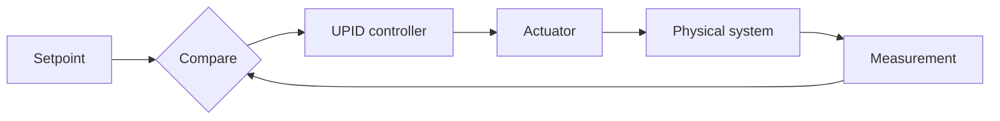
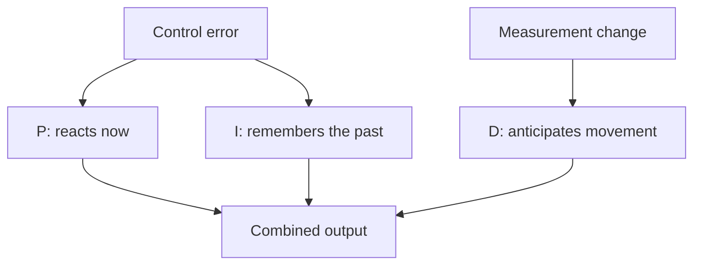
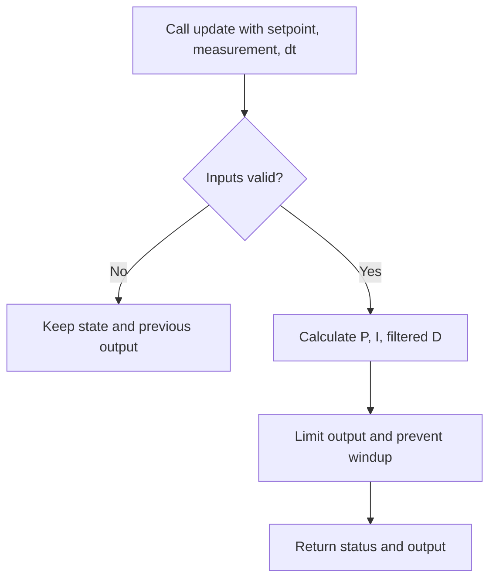

# Universal PID Controller Implementation Plan

> **For agentic workers:** REQUIRED SUB-SKILL: Use superpowers:subagent-driven-development (recommended) or superpowers:executing-plans to implement this plan task-by-task. Steps use checkbox (`- [ ]`) syntax for tracking.

**Goal:** Build a production-ready, dependency-free PID controller library for broad Arduino targets and native ESP-IDF, with deterministic host tests and beginner-friendly graphical documentation.

**Architecture:** A single compiled C++11 core in `src/upid.h` and `src/upid.cpp` owns all PID state and accepts elapsed seconds from the caller. Arduino and ESP-IDF consume the same sources through ecosystem-specific root metadata; neither platform leaks into the control algorithm.

**Tech Stack:** C++11, CMake 3.16+, CTest, Arduino CLI, ESP-IDF CMake component model, Markdown, Mermaid

## Global Constraints

- Use `float` throughout version 1.
- Use continuous-time gains: `dt` is seconds, `Ki` is per second, and `Kd` is seconds.
- Require C++11 and no heap allocation, exceptions, RTTI, callbacks, framework headers, or platform clock.
- Support compile checks for representative AVR, SAMD, RP2040, ESP32 Arduino, and native ESP-IDF targets.
- Treat `architectures=*` as source-level portability, not verified hardware support.
- Keep exactly five statuses: `Ok`, `InvalidTimeStep`, `NonFiniteInput`, `InvalidConfiguration`, and `WrongMode`.
- Preserve configuration and runtime state after every rejected operation.
- Do not claim runtime hardware validation unless it was performed on physical hardware.

## File Map

- `src/upid.h`: complete public API and value types.
- `src/upid.cpp`: validation, PID terms, filtering, saturation, modes, and state transitions.
- `tests/test_upid.cpp`: dependency-free host test executable.
- `CMakeLists.txt`: dual host-test and ESP-IDF component entry point.
- `library.properties`: Arduino library metadata.
- `examples/arduino/basic_pid/basic_pid.ino`: framework-neutral Arduino usage.
- `examples/esp_idf/basic_pid/CMakeLists.txt`: standalone ESP-IDF example project.
- `examples/esp_idf/basic_pid/main/CMakeLists.txt`: example component registration.
- `examples/esp_idf/basic_pid/main/main.cpp`: native ESP-IDF usage.
- `README.md`: beginner tutorial, installation, API guidance, diagrams, and validation claims.
- `.github/workflows/ci.yml`: host tests and representative compile checks.

---

### Task 1: Public API, Build Harness, and Configuration Validation

**Files:**
- Create: `src/upid.h`
- Create: `src/upid.cpp`
- Create: `tests/test_upid.cpp`
- Create: `CMakeLists.txt`

**Interfaces:**
- Produces:
  - `enum class Status { Ok, InvalidTimeStep, NonFiniteInput, InvalidConfiguration, WrongMode };`
  - `enum class Direction { Direct, Reverse };`
  - `enum class Mode { Manual, Automatic };`
  - `struct Config`
  - `struct Result { Status status; float output; };`
  - `class Controller`
  - `Status Controller::setConfig(const Config&)`
  - `const Config& Controller::config() const`
  - `Status Controller::configurationStatus() const`

- [ ] **Step 1: Write the failing configuration tests**

Create a tiny test runner using `CHECK(condition)` and add tests proving:

```cpp
upid::Config valid;
valid.kp = 1.0f;
valid.ki = 0.2f;
valid.kd = 0.1f;
valid.outputMin = -10.0f;
valid.outputMax = 10.0f;
valid.derivativeFilterTau = 0.05f;
valid.direction = upid::Direction::Direct;

upid::Controller controller(valid);
CHECK(controller.configurationStatus() == upid::Status::Ok);

upid::Config invalid = valid;
invalid.outputMin = 10.0f;
invalid.outputMax = 10.0f;
CHECK(controller.setConfig(invalid) == upid::Status::InvalidConfiguration);
CHECK(controller.config().outputMin == -10.0f);
CHECK(controller.config().outputMax == 10.0f);

invalid = valid;
invalid.kp = -1.0f;
CHECK(controller.setConfig(invalid) == upid::Status::InvalidConfiguration);

invalid = valid;
invalid.ki = std::numeric_limits<float>::infinity();
CHECK(controller.setConfig(invalid) == upid::Status::NonFiniteInput);
```

Also construct a controller from an invalid configuration and verify
`configurationStatus() == InvalidConfiguration`.

- [ ] **Step 2: Run the test to verify it fails**

Run:

```bash
cmake -S . -B build -DUPID_BUILD_TESTS=ON
cmake --build build
ctest --test-dir build --output-on-failure
```

Expected: configure or compile failure because the files/API do not exist.

- [ ] **Step 3: Implement the public types and atomic validation**

Define `Config` with these defaults and fields:

```cpp
Config()
    : kp(0.0f),
      ki(0.0f),
      kd(0.0f),
      outputMin(0.0f),
      outputMax(1.0f),
      derivativeFilterTau(0.0f),
      direction(Direction::Direct) {}

float kp;
float ki;
float kd;
float outputMin;
float outputMax;
float derivativeFilterTau;
Direction direction;
```

Define this controller surface:

```cpp
explicit Controller(const Config& config);

Status configurationStatus() const;
const Config& config() const;
Status setConfig(const Config& config);

Result update(float setpoint, float measurement, float dtSeconds);
Status setMode(Mode mode);
Status setMode(Mode mode, float manualOutput);
Status reset(float measurement, float output);

Mode mode() const;
float output() const;
```

`setConfig()` must first validate every candidate field, then commit the whole
configuration. Return `NonFiniteInput` for any non-finite field and
`InvalidConfiguration` for negative gains/filter time or unordered limits.
An invalid constructor argument leaves the object marked invalid until a valid
`setConfig()` succeeds.

Create a root CMake file that:

```cmake
cmake_minimum_required(VERSION 3.16)

if(ESP_PLATFORM)
    idf_component_register(SRCS "src/upid.cpp" INCLUDE_DIRS "src")
else()
    project(upid LANGUAGES CXX)
    add_library(upid src/upid.cpp)
    target_include_directories(upid PUBLIC src)
    target_compile_features(upid PUBLIC cxx_std_11)
    option(UPID_BUILD_TESTS "Build UPID host tests" ON)
    if(UPID_BUILD_TESTS)
        enable_testing()
        add_executable(upid_tests tests/test_upid.cpp)
        target_link_libraries(upid_tests PRIVATE upid)
        add_test(NAME upid_tests COMMAND upid_tests)
    endif()
endif()
```

- [ ] **Step 4: Run tests and compiler warnings**

Run:

```bash
cmake -S . -B build -DUPID_BUILD_TESTS=ON
cmake --build build --clean-first
ctest --test-dir build --output-on-failure
cmake -S . -B build-warnings -DUPID_BUILD_TESTS=ON -DCMAKE_CXX_FLAGS="-Wall -Wextra -Wpedantic -Werror"
cmake --build build-warnings
ctest --test-dir build-warnings --output-on-failure
```

Expected: all configuration tests pass with no warnings.

- [ ] **Step 5: Commit**

```bash
git add CMakeLists.txt src/upid.h src/upid.cpp tests/test_upid.cpp
git commit -m "feat: add PID API and configuration validation"
```

---

### Task 2: Proportional Control, Direction, and Update Validation

**Files:**
- Modify: `src/upid.h`
- Modify: `src/upid.cpp`
- Modify: `tests/test_upid.cpp`

**Interfaces:**
- Consumes: Task 1 `Controller`, `Config`, `Result`, `Status`, and `Direction`.
- Produces: working `Result update(float setpoint, float measurement, float dtSeconds)`.

- [ ] **Step 1: Add failing proportional and invalid-update tests**

Add table-driven checks:

```cpp
upid::Config config;
config.kp = 2.0f;
config.outputMin = -100.0f;
config.outputMax = 100.0f;

upid::Controller direct(config);
CHECK_NEAR(direct.update(10.0f, 7.0f, 0.1f).output, 6.0f, 1e-6f);

config.direction = upid::Direction::Reverse;
upid::Controller reverse(config);
CHECK_NEAR(reverse.update(10.0f, 7.0f, 0.1f).output, -6.0f, 1e-6f);
```

Verify `dt` of zero, a negative value, NaN, and infinity returns the required
status and previous output. Repeat for non-finite setpoint and measurement.
After every rejection, run a valid update and prove the rejected update did not
change controller state.

- [ ] **Step 2: Run tests to verify failure**

Run:

```bash
cmake --build build
ctest --test-dir build --output-on-failure
```

Expected: proportional/update tests fail because `update()` is not implemented.

- [ ] **Step 3: Implement validated proportional updates**

Implement error as:

```cpp
const float directionSign =
    config_.direction == Direction::Direct ? 1.0f : -1.0f;
const float error = directionSign * (setpoint - measurement);
const float candidate = config_.kp * error;
```

Validate all arguments before calculating or mutating state. Clamp the result
to `[outputMin, outputMax]`. Reject calls while configuration is invalid with
`InvalidConfiguration`. Commit `lastOutput_` only for a valid update.

- [ ] **Step 4: Run all tests**

Run:

```bash
cmake --build build --clean-first
ctest --test-dir build --output-on-failure
```

Expected: all tests pass.

- [ ] **Step 5: Commit**

```bash
git add src/upid.h src/upid.cpp tests/test_upid.cpp
git commit -m "feat: add validated proportional control"
```

---

### Task 3: Integral Control, Saturation, and Conditional Anti-Windup

**Files:**
- Modify: `src/upid.cpp`
- Modify: `tests/test_upid.cpp`

**Interfaces:**
- Consumes: validated update and `Config::ki`.
- Produces: integral contribution stored in output units and conditional integration at both limits.

- [ ] **Step 1: Add failing integral tests**

Test a pure integral controller:

```cpp
config.kp = 0.0f;
config.ki = 2.0f;
config.kd = 0.0f;
config.outputMin = -100.0f;
config.outputMax = 100.0f;

upid::Controller controller(config);
CHECK_NEAR(controller.update(1.0f, 0.0f, 0.25f).output, 0.5f, 1e-6f);
CHECK_NEAR(controller.update(1.0f, 0.0f, 0.50f).output, 1.5f, 1e-6f);
```

Add upper- and lower-saturation sequences. Hold an error that drives farther
into saturation for 100 updates, reverse the error, and verify the output
leaves saturation on the first recovery update instead of unwinding a hidden
integral. Include variable-`dt` cases that produce the same accumulated area.

- [ ] **Step 2: Run tests to verify failure**

Run:

```bash
cmake --build build
ctest --test-dir build --output-on-failure
```

Expected: integral and anti-windup assertions fail.

- [ ] **Step 3: Implement conditional integration**

Calculate:

```cpp
const float integralCandidate =
    integral_ + config_.ki * error * dtSeconds;
const float unsaturatedCandidate =
    proportional + integralCandidate - derivative;
```

Accept `integralCandidate` when the candidate output is inside the limits, when
it is above the maximum and `error < 0`, or when it is below the minimum and
`error > 0`. Otherwise keep the old integral contribution. Recompute and clamp
the output using the accepted integral.

- [ ] **Step 4: Run all tests**

Run:

```bash
cmake --build build --clean-first
ctest --test-dir build --output-on-failure
```

Expected: pure-integral, variable-time, saturation, and recovery tests pass.

- [ ] **Step 5: Commit**

```bash
git add src/upid.cpp tests/test_upid.cpp
git commit -m "feat: add integral anti-windup"
```

---

### Task 4: Derivative-on-Measurement and Filtering

**Files:**
- Modify: `src/upid.cpp`
- Modify: `tests/test_upid.cpp`

**Interfaces:**
- Consumes: `Config::kd`, `Config::derivativeFilterTau`, and previous measurement state.
- Produces: derivative contribution with a time-constant-based first-order low-pass filter.

- [ ] **Step 1: Add failing derivative tests**

Add tests proving:

```cpp
config.kp = 0.0f;
config.ki = 0.0f;
config.kd = 1.0f;
config.derivativeFilterTau = 0.0f;
config.outputMin = -100.0f;
config.outputMax = 100.0f;
```

- The first valid update initializes measurement history and has zero derivative.
- Changing only setpoint produces no derivative kick.
- Increasing measurement by `2.0f` over `0.5f` seconds produces `-4.0f` direct-action output.
- Reverse direction flips the full controller action consistently.
- With `tau = 0.5f` and `dt = 0.5f`, a derivative input step is filtered using `alpha = dt / (tau + dt)`.
- A rejected update does not alter previous measurement or filter state.

- [ ] **Step 2: Run tests to verify failure**

Run:

```bash
cmake --build build
ctest --test-dir build --output-on-failure
```

Expected: derivative tests fail.

- [ ] **Step 3: Implement the derivative term**

For initialized history calculate:

```cpp
const float rawMeasurementRate =
    (measurement - previousMeasurement_) / dtSeconds;
const float alpha = config_.derivativeFilterTau == 0.0f
    ? 1.0f
    : dtSeconds / (config_.derivativeFilterTau + dtSeconds);
filteredMeasurementRate_ +=
    alpha * (rawMeasurementRate - filteredMeasurementRate_);
const float derivative =
    directionSign * config_.kd * filteredMeasurementRate_;
```

Combine output as `P + I - D`. On the first valid automatic calculation,
initialize measurement history and use a zero derivative contribution.

- [ ] **Step 4: Run all tests**

Run:

```bash
cmake --build build --clean-first
ctest --test-dir build --output-on-failure
```

Expected: all derivative, filter, and existing tests pass.

- [ ] **Step 5: Commit**

```bash
git add src/upid.cpp tests/test_upid.cpp
git commit -m "feat: add filtered derivative control"
```

---

### Task 5: Manual Mode, Bumpless Transfer, Reset, and Runtime Tuning

**Files:**
- Modify: `src/upid.h`
- Modify: `src/upid.cpp`
- Modify: `tests/test_upid.cpp`

**Interfaces:**
- Consumes: complete automatic PID calculation.
- Produces:
  - `Status setMode(Mode::Manual, float manualOutput)`
  - `Status setMode(Mode::Automatic)`
  - `Status reset(float measurement, float output)`
  - atomic runtime `setConfig()`

- [ ] **Step 1: Add failing mode and reset tests**

Verify:

```cpp
CHECK(controller.setMode(upid::Mode::Manual, 3.0f) == upid::Status::Ok);
upid::Result manual = controller.update(10.0f, 0.0f, 0.1f);
CHECK(manual.status == upid::Status::WrongMode);
CHECK_NEAR(manual.output, 3.0f, 1e-6f);

CHECK(controller.setMode(upid::Mode::Automatic) == upid::Status::Ok);
upid::Result transition = controller.update(10.0f, 4.0f, 0.1f);
CHECK(transition.status == upid::Status::Ok);
CHECK_NEAR(transition.output, 3.0f, 1e-6f);
```

Then verify the following update performs PID calculation without a transition
jump. Test an invalid pending-transition update: it must preserve manual output,
state, and pending transition. Test invalid manual outputs, inappropriate
overloads (`setMode(Manual)` and `setMode(Automatic, value)`), repeated mode
calls, and both directions.

Test `reset(measurement, output)` with finite values, clamped output, measurement
history initialized, filtered derivative cleared, and the integral contribution
set to the clamped reset output. The following update may add proportional
action for its supplied setpoint. Non-finite reset arguments must preserve all
state.

Test valid runtime tuning, rejection of invalid tuning, and a limit reduction
that clamps output/integral atomically into the new range.

- [ ] **Step 2: Run tests to verify failure**

Run:

```bash
cmake --build build
ctest --test-dir build --output-on-failure
```

Expected: mode, transition, reset, or runtime-tuning assertions fail.

- [ ] **Step 3: Implement the state machine**

Use explicit private flags:

```cpp
Mode mode_;
bool automaticTransitionPending_;
bool measurementInitialized_;
```

`setMode(Manual, output)` validates and clamps the output, enters manual mode,
and clears pending transition. `setMode(Automatic)` from manual sets only the
pending flag. Its first valid update sets:

```cpp
previousMeasurement_ = measurement;
filteredMeasurementRate_ = 0.0f;
integral_ = clamp(lastOutput_ - proportional, outputMin, outputMax);
mode_ = Mode::Automatic;
automaticTransitionPending_ = false;
```

That transition update returns the preserved manual output. The next update
runs PID. Wrong overloads return `WrongMode` without mutation.

Implement `reset()` and `setConfig()` so all candidate values and derived state
are calculated locally and committed together only after validation.

- [ ] **Step 4: Run the full host suite with sanitizers**

Run:

```bash
cmake --build build --clean-first
ctest --test-dir build --output-on-failure
cmake -S . -B build-sanitize -DUPID_BUILD_TESTS=ON -DCMAKE_CXX_FLAGS="-fsanitize=address,undefined -fno-omit-frame-pointer"
cmake --build build-sanitize
ctest --test-dir build-sanitize --output-on-failure
```

Expected: all tests pass; sanitizers report no finding.

- [ ] **Step 5: Commit**

```bash
git add src/upid.h src/upid.cpp tests/test_upid.cpp
git commit -m "feat: add PID modes and runtime state control"
```

---

### Task 6: Arduino and ESP-IDF Packaging, Examples, and CI

**Files:**
- Create: `library.properties`
- Modify: `CMakeLists.txt`
- Create: `examples/arduino/basic_pid/basic_pid.ino`
- Create: `examples/esp_idf/basic_pid/CMakeLists.txt`
- Create: `examples/esp_idf/basic_pid/main/CMakeLists.txt`
- Create: `examples/esp_idf/basic_pid/main/main.cpp`
- Create: `.github/workflows/ci.yml`

**Interfaces:**
- Consumes: `#include <upid.h>` and the complete Task 5 API.
- Produces: installable Arduino library, ESP-IDF component, compilable examples, and reproducible CI checks.

- [ ] **Step 1: Add packaging metadata and minimal examples**

Create `library.properties` with:

```properties
name=UPID
version=0.1.0
author=JonasAxd
maintainer=JonasAxd
sentence=A portable, deterministic PID controller for Arduino and ESP-IDF.
paragraph=Production-ready PID control with anti-windup, filtered derivative, manual mode, and explicit elapsed time.
category=Signal Input/Output
url=https://github.com/JonasAxd/upid
architectures=*
includes=upid.h
```

Both examples must configure a controller, calculate seconds explicitly, check
`Result::status`, and apply `Result::output`. The Arduino example may call
`micros()` in the sketch; the native ESP-IDF example may call
`esp_timer_get_time()`. Neither clock API may appear under `src/`.

- [ ] **Step 2: Add CI jobs**

Create jobs that run:

```bash
cmake -S . -B build -DUPID_BUILD_TESTS=ON
cmake --build build
ctest --test-dir build --output-on-failure
```

Add Arduino CLI compile matrix entries for representative board FQBNs:

```text
arduino:avr:uno
arduino:samd:mkrzero
rp2040:rp2040:rpipico
esp32:esp32:esp32
```

Pin action and board-core versions in the workflow. Add an ESP-IDF job that
builds `examples/esp_idf/basic_pid` using an official pinned Espressif action or
container. Do not add credentials or publishing.

- [ ] **Step 3: Run locally available packaging checks**

Run:

```bash
cmake -S . -B build -DUPID_BUILD_TESTS=ON
cmake --build build --clean-first
ctest --test-dir build --output-on-failure
arduino-cli version
idf.py --version
```

If Arduino CLI or ESP-IDF is installed, compile the exact examples with the
installed representative cores. If a tool/core is unavailable, report that
check as `not run`; do not claim it passed based on workflow syntax.

- [ ] **Step 4: Verify platform isolation**

Run:

```bash
rg -n '#include <(Arduino|esp_|freertos)|micros\\(|millis\\(|esp_timer' src
```

Expected: no matches.

Run all available host, Arduino, and ESP-IDF builds again. Expected: every
available check passes.

- [ ] **Step 5: Commit**

```bash
git add library.properties CMakeLists.txt examples .github/workflows/ci.yml
git commit -m "build: package UPID for Arduino and ESP-IDF"
```

---

### Task 7: Beginner-Friendly Graphical README

**Files:**
- Create: `README.md`
- Modify: `examples/arduino/basic_pid/basic_pid.ino`
- Modify: `examples/esp_idf/basic_pid/main/main.cpp`

**Interfaces:**
- Consumes: the final public API and verified commands from Tasks 1–6.
- Produces: a beginner-first guide whose snippets compile from the examples.

- [ ] **Step 1: Write the README teaching path**

Start with a one-sentence purpose and a minimal example copied from the Arduino
example. Include these Mermaid diagrams:







Add:

- “PID in plain language”
- installation for Arduino ZIP/library folder and ESP-IDF `components/`
- explicit warning that `dtSeconds` is seconds
- minimal and full configuration examples
- direct versus reverse direction
- output limits and conditional anti-windup
- derivative filtering with `tau = 0` behavior
- manual mode and the two-update bumpless transition timeline
- reset and runtime tuning
- a table for exactly five statuses
- a manual tuning flowchart
- troubleshooting
- development/build commands
- a compatibility table distinguishing host compilation, platform compilation,
  and physical hardware validation

- [ ] **Step 2: Check every README snippet against examples/API**

For each C++ code block, either compile it as part of an example or make it an
exact excerpt of an already compiled example. Search all public names:

```bash
rg -n 'Controller|Config|Result|Status|Direction|Mode|setMode|reset|update' README.md examples src/upid.h
```

Expected: README names and signatures match `src/upid.h`.

- [ ] **Step 3: Validate Markdown and diagrams**

Confirm each Mermaid fence is closed, node identifiers are unique within each
diagram, and no diagram contradicts the text. Render through GitHub after push;
if GitHub reports a Mermaid syntax error, fix it before completion.

Run:

```bash
git diff --check
cmake --build build --clean-first
ctest --test-dir build --output-on-failure
```

Expected: clean diff and passing host suite.

- [ ] **Step 4: Commit**

```bash
git add README.md examples/arduino/basic_pid/basic_pid.ino examples/esp_idf/basic_pid/main/main.cpp
git commit -m "docs: add beginner guide and PID diagrams"
```

---

### Task 8: Final Review and Release-Readiness Verification

**Files:**
- Modify only files required by validated review findings.

**Interfaces:**
- Consumes: all implementation, packaging, examples, tests, and documentation.
- Produces: reviewed version `0.1.0` candidate on the private repository.

- [ ] **Step 1: Run independent correctness and edge-case reviews**

Request correctness review, then edge-case review focusing on:

- conditional-integration sign behavior in both directions
- derivative kick and variable time steps
- pending automatic transition
- invalid-operation state preservation
- float overflow/NaN propagation
- limit changes and reset behavior
- API consistency across examples and README

- [ ] **Step 2: Fix only validated findings using TDD**

For each accepted finding, first add a failing regression test, observe the
failure, implement the minimal fix, and observe the passing test. Keep unrelated
refactoring out of this release.

- [ ] **Step 3: Run final verification**

Run:

```bash
cmake -S . -B build-final -DUPID_BUILD_TESTS=ON -DCMAKE_CXX_FLAGS="-Wall -Wextra -Wpedantic -Werror"
cmake --build build-final
ctest --test-dir build-final --output-on-failure
git diff --check
git status --short
```

Run every locally available Arduino and ESP-IDF compile command established in
Task 6. Record unavailable tools as `not run`.

- [ ] **Step 4: Push the reviewed private candidate**

```bash
git push origin main
```

Inspect GitHub Actions and report each job's observed result. Keep the repository
private; public release requires a separate explicit user instruction.

